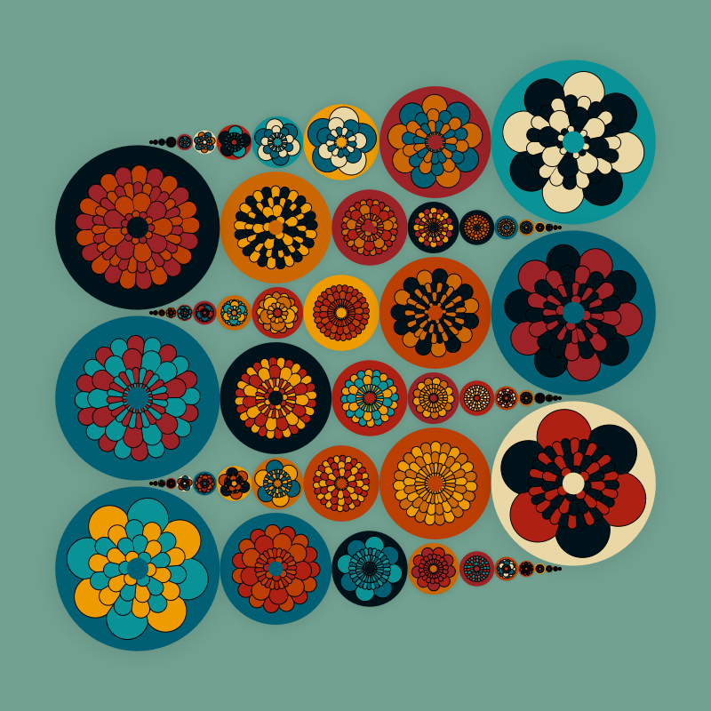
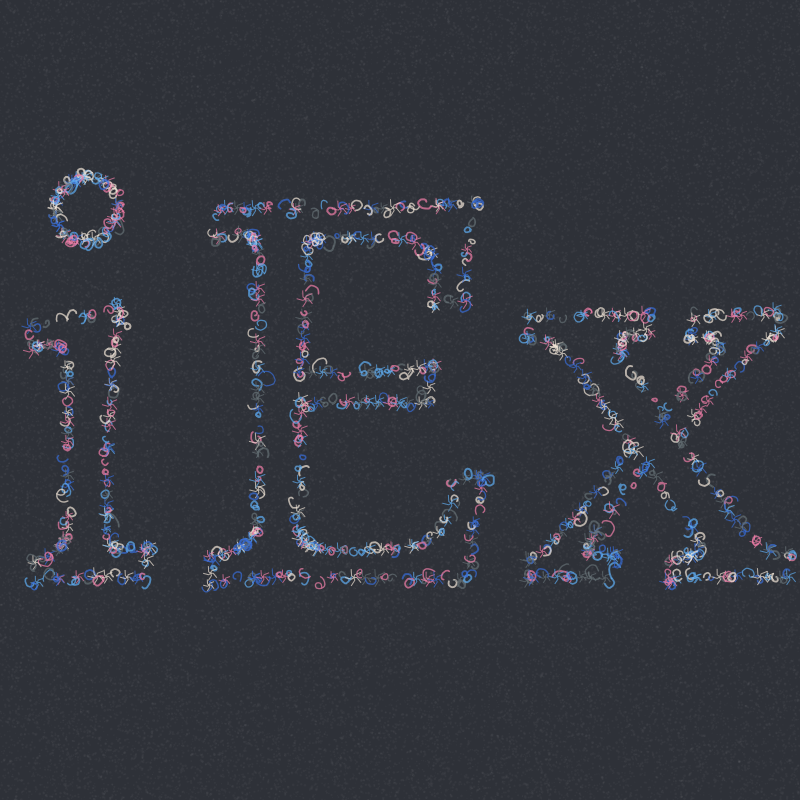
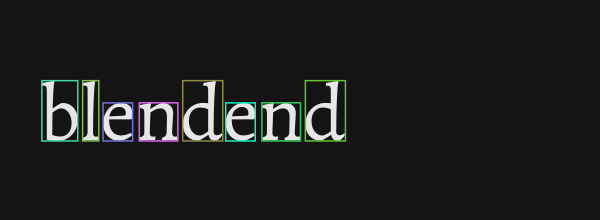

# blendend

`blendend` brings [Blend2D](https://github.com/blend2d/blend2d)'s fast, high-quality 2D vector renderer to Elixir.
It gives crisp antialiased shapes, gradients, text, and blending via an Elixir API, that speaks `blend2D` directly (via NIF).
The project is still evolving.

<p align="center">
  
</p>
 
## Features

- Canvas API (fill/stroke shapes, paths, transforms, compositing).
- Text shaping (font loading, glyph outlines).
- Gradients/patterns, blur effects, masks.
- Path DSL/macros for ergonomic drawing.
- Examples and playground scripts.

## Requirements

- The latest Blend2D built and installed on your system
- A C++ toolchain (a C++ compiler + cmake)

Quick build of Blend2D:
```sh
git clone https://github.com/blend2d/blend2d
cd blend2d
git clone https://github.com/asmjit/asmjit 3rdparty/asmjit
mkdir build && cd build
cmake ..
make -j$(nproc)
sudo make install
```

## Install in your project

```elixir
def deps do
  [
    {:blendend, github: "narslan/blendend"}
  ]
end
```

Then:
```sh
mix deps.get
mix compile
```

## Quick start

`blendend` is meant to feel like a sketchbook: open a canvas, put shapes here and there, get pixels back. The `Blendend.Draw` macros keep things terse so you can focus on shapes and color rather than boilerplate.

Below, we draw a single white line and write it to disk. Change the block to add circles, text, gradients, or any of the other helpers in `Blendend.Draw`.

```elixir
use Blendend.Draw

draw 200, 200, "priv/basic_line.png" do
  line 0, 100, 200, 100, stroke: rgb(255, 255, 255)
end
```

## Roadmap
- Multi-threaded drawing pipelines are not supported yet; rendering runs single-threaded for now.
- Gradient transformations and extend modes are planned so gradients can be positioned and repeated more flexibly.
 
## Playground
For a richer starting point, clone the [blendend_playground](https://github.com/narslan/blendend_playground) repo and run it to browse and tweak the bundled examples in the browser.

## Goals
- Declarative. Knowledge of colors, gradients, shapes, shadows
and transformations guide you.

- Each shape can carry its own style, and avoiding global setters prevents accidental style leaks when a set call is missed.

#### colors
```elixir
hsv(0, 1.0, 1.0) #gives you red
hsv(0, 1.0, 1.0, 0) #gives no color back.
hsv(60, 1.0, 1.0, 255) #gives yellow.
hsv(60, 1.0, 1.0, 100) #shades yellow.
rgb(255, 255, 0) #gives yellow.
```
#### gradient
```elixir
grad2 = linear_gradient 0, 0, 0, 200 do
        add_stop(0.0, rgb(255, 0, 0))
        add_stop(0.5, rgb(0, 255, 0))
        add_stop(1.0, rgb(0, 0, 255))
      end
box(0, 0, 100, 200, fill: grad2)
```
Colors change gradually in a box.

### transformation
```elixir
# Calculate transformation
m =
  matrix do
    translate(x, y)
    rotate(:math.pi() / 2)
    scale(2, 2)
  end

# Construct a path 
path p1 do
  line_to 100.0, 100.0
end
# Construct another 
p2 = path()

# apply transformation.
p1 = Blendend.Path.add_path!(p1, p2, m) # It returns p1 
# decorate with shadow
shadow_path(p1, 10.0, 8.0, 15.0, fill: rgb(250, 0, 0, 150)) shadows the background or outline of a path.
```


## Gallery

<table>
  <tr>
    <td width="50%">
      <strong>Vector tracing</strong><br>
      
    </td>
    <td width="50%">
      <strong>Blur effect</strong><br>
      
    </td>
  </tr>
  <tr>
    <td width="50%">
      <strong> Color blending  </strong><br>
      
    </td>  
    <td width="50%">
      <strong>Path flatten</strong><br>
      
    </td>
  </tr>
  <tr>
      <td width="50%">
      <strong>Glyph Bounds</strong><br>
      
    </td>
    <td width="50%">
    </td>
  </tr>
</table>

## Licenses 

- This project is released under the MIT License (see `LICENSE`).
- `blend2d` is licensed under the zlib license.
- `priv/fonts/Alegreya-Regular.otf` is distributed under the SIL Open Font License.
- The burn grid demo and flower waves (which are available in `blendend_playground`) is adapted from takawo's original p5.js sketch (https://openprocessing.org/user/6533) and shared under the Creative Commons BY-NC-SA 3.0 license (https://creativecommons.org/licenses/by-nc-sa/3.0/).
