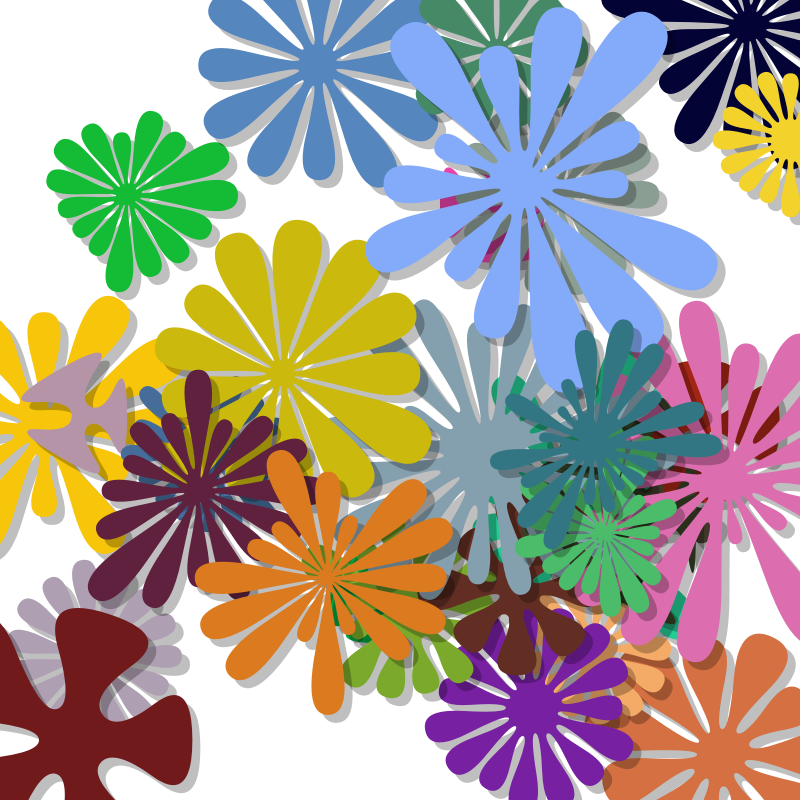

# blendend

Elixir bindings to [Blend2D](https://blend2d.com/) – a fast 2D renderer – for drawing shapes, text, and gradients into images.

- Blend2D's rendering engine from plain Elixir.
- Composable drawing pipeline: `Canvas`, `Path`, `Matrix2D`, `Text`, `Style` modules.
- A concise DSL (`Blendend.Draw`) for scripts/playgrounds 
- Support for PNG/QOI export plus masking, gradients, patterns, and text shaping.

## Status

**Early, experimental.** APIs may change; feedback and bug reports are welcome.

## Requirements

- The latest Blend2D built and installed on your system
- A C++ toolchain (a C++ compiler + cmake)

Quick build of Blend2D:
```sh
git clone https://github.com/blend2d/blend2d
cd blend2d
git clone https://github.com/asmjit/asmjit 3rdparty/asmjit
mkdir build && cd build
cmake ..
make -j$(nproc)
sudo make install
```

## Install in your project

```elixir
def deps do
  [
    {:blendend, github: "narslan/blendend"}
  ]
end
```

Then:
```sh
mix deps.get
mix compile
```

## Quick start

Using the DSL:
```elixir
use Blendend.Draw

draw 200, 200, "priv/basic_line.png" do
  line 0, 100, 200, 100, stroke: color(255, 255, 255)
end
```

## Playground

There is a separate web playground for live editing and rendering, and for browsing the bundled examples:
[blendend_playground](https://github.com/narslan/blendend_playground).

## Gallery





## Licenses & Assets

- This project is released under the MIT License (see `LICENSE`).
- `blend2d` is licensed under the zlib license.
- `priv/fonts/Alegreya-Regular.otf` is distributed under the SIL Open Font License.
