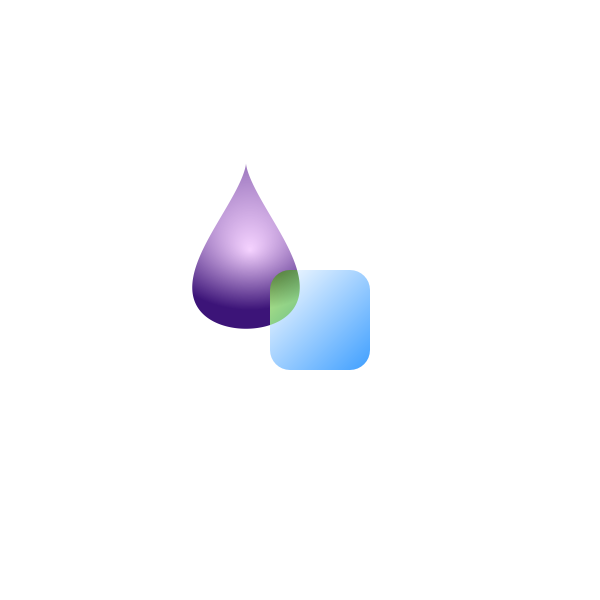
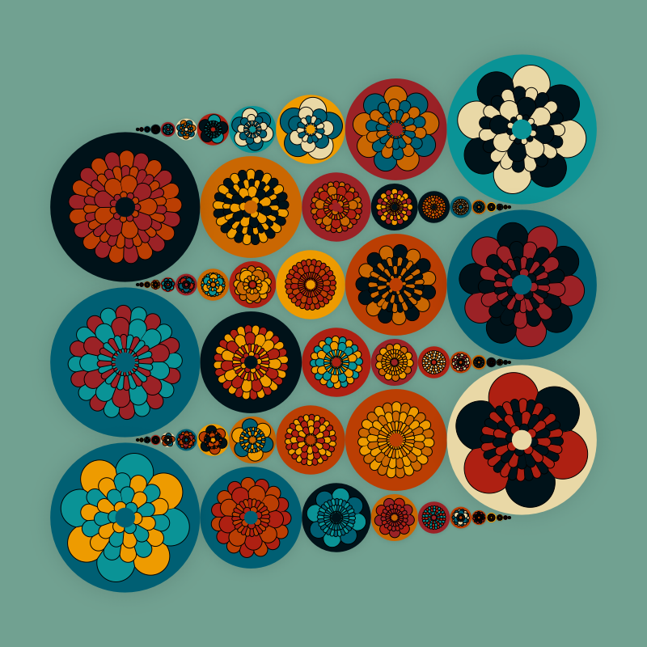
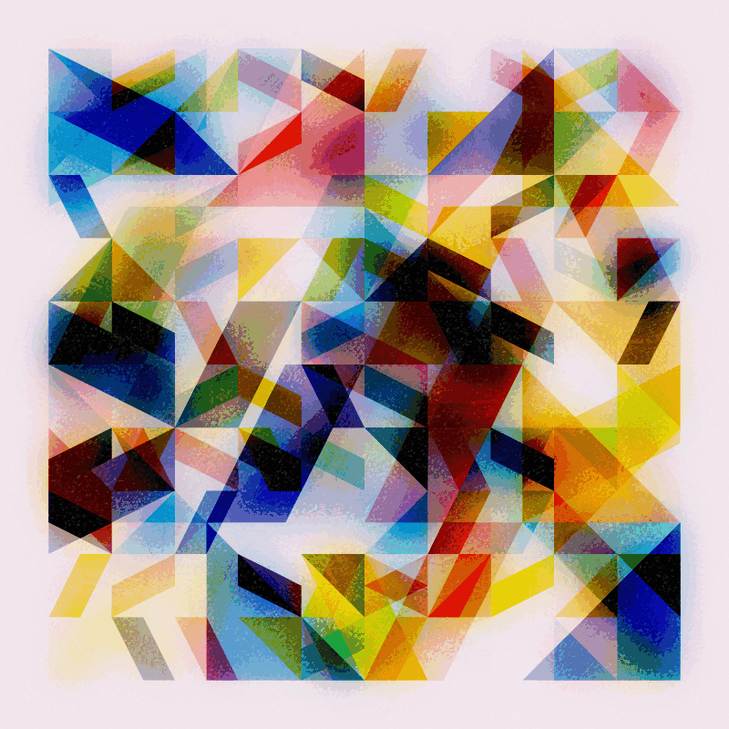
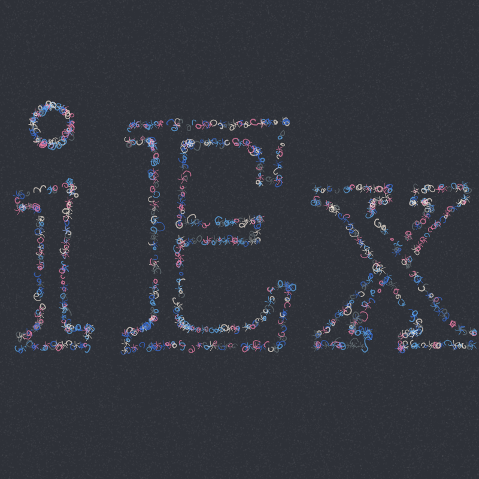
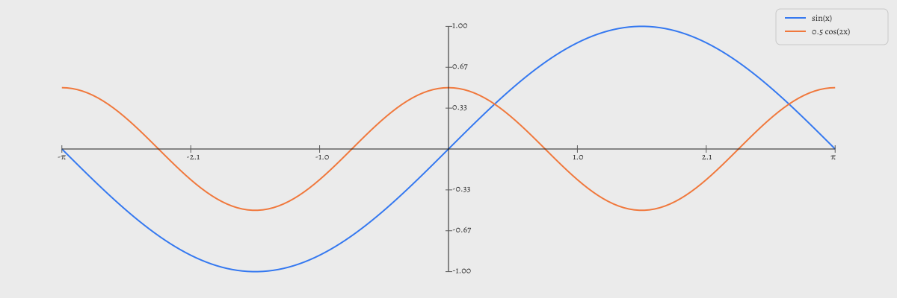

# blendend

<p align="center">
  
</p>

[](https://livebook.dev/run?url=https://raw.githubusercontent.com/narslan/blendend/main/notebooks/blendend_intro.livemd)

This project provides Elixir bindings to [Blend2D](https://github.com/blend2d/blend2d) .
- `blendend` is currently in experimental stage. But most of the functionalities have been already implemented. 

- Blend2D's rendering engine from plain Elixir.
- Composable drawing pipeline: `Canvas`, `Path`, `Matrix2D`, `Text`, `Style` modules.
- A DSL (`Blendend.Draw`) for concise scripts. 
- Support for PNG/QOI export. 


## Requirements

- The latest Blend2D built and installed on your system
- A C++ toolchain (a C++ compiler + cmake)

Quick build of Blend2D:
```sh
git clone https://github.com/blend2d/blend2d
cd blend2d
git clone https://github.com/asmjit/asmjit 3rdparty/asmjit
mkdir build && cd build
cmake ..
make -j$(nproc)
sudo make install
```

## Install in your project

```elixir
def deps do
  [
    {:blendend, github: "narslan/blendend"}
  ]
end
```

Then:
```sh
mix deps.get
mix compile
```

## Quick start

`blendend` is meant to feel like a sketchbook: open a canvas, write a few lines, get pixels back. After adding the dependency and compiling, you can start an IEx session or drop a script anywhere in your project. The `Blendend.Draw` DSL keeps things terse so you can focus on shapes and color rather than boilerplate.

Below, we draw a single white line and write it to disk. Change the block to add circles, text, gradients, or any of the other helpers in `Blendend.Draw`.

```elixir
use Blendend.Draw

draw 200, 200, "priv/basic_line.png" do
  line 0, 100, 200, 100, stroke: rgb(255, 255, 255)
end
```

For a richer starting point, clone the [blendend_playground](https://github.com/narslan/blendend_playground) repo and run it to browse and tweak the bundled examples in the browser.

[Run in Livebook](https://livebook.dev/run?url=https://raw.githubusercontent.com/narslan/blendend/refs/heads/livebook-integration/notebooks/blendend_intro.livemd)

## Playground

There is a separate web playground for live editing and rendering, and for browsing the bundled examples:
[blendend_playground](https://github.com/narslan/blendend_playground).


## Gallery

<table>
  <tr>
    <td width="50%">
      <strong>Adorable tiger (vector tracing)</strong><br>
      
    </td>
    <td width="50%">
      <strong>Flower waves (blur effect)</strong><br>
      
    </td>
  </tr>
  <tr>
    <td width="50%">
      <strong> Burn gradients </strong><br>
      
    </td>  
    <td width="50%">
      <strong></strong><br>
      
    </td>
  </tr>
  <tr>
      <td width="50%">
      <strong>Easy to plot</strong><br>
      
    </td>
    <td width="50%">
    </td>
  </tr>
</table>

## Licenses 

- This project is released under the MIT License (see `LICENSE`).
- `blend2d` is licensed under the zlib license.
- `priv/fonts/Alegreya-Regular.otf` is distributed under the SIL Open Font License.
- The burn grid demo and flower waves (which are available in `blendend_playground`) is adapted from takawo's original p5.js sketch (https://openprocessing.org/user/6533) and shared under the Creative Commons BY-NC-SA 3.0 license (https://creativecommons.org/licenses/by-nc-sa/3.0/).
